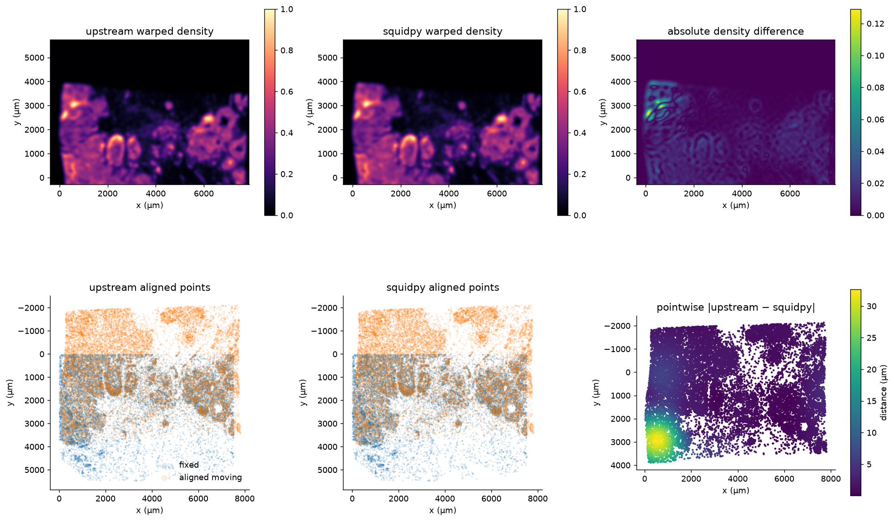
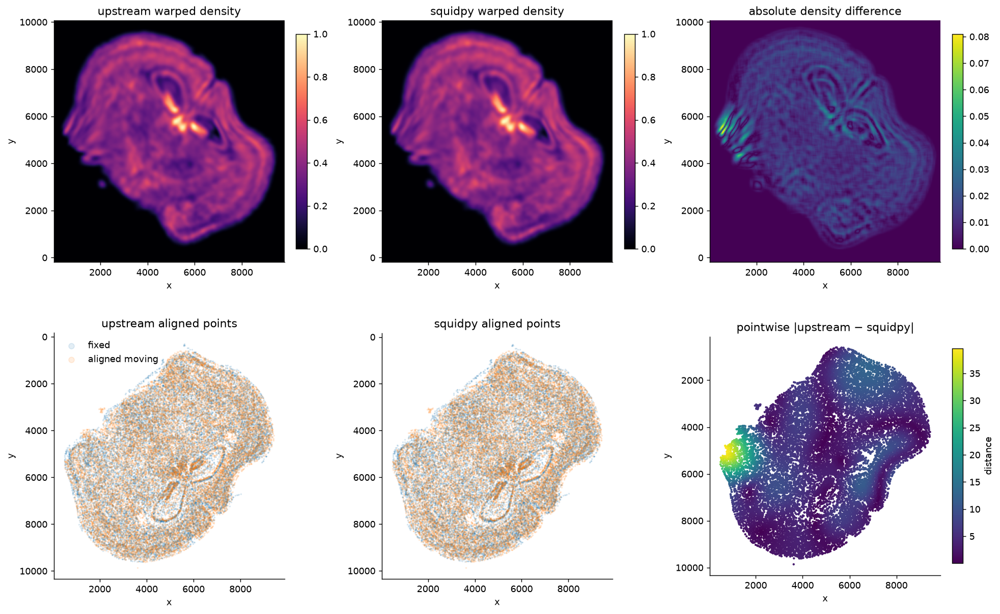
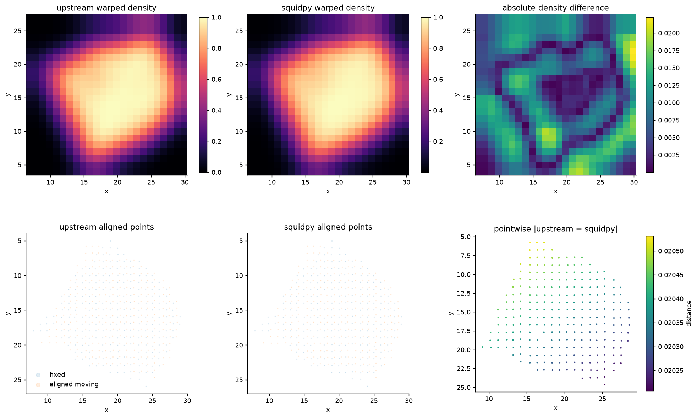

# STalign in squidpy: upstream PyTorch vs the JAX port

squidpy's `experimental.tl.align` reimplements [STalign](https://github.com/JEFworks-Lab/STalign)'s
affine + LDDMM alignment in JAX. This page validates that port against upstream STalign on three
real datasets — it shows what upstream produces natively, the one-to-one comparison against the
port on identical inputs, the numerical agreement, how correctness is enforced by tests, and how to
reproduce every panel from a single container.

All squidpy results here come from the pinned fork
[`selmanozleyen/squidpy@6a63ff8`](https://github.com/selmanozleyen/squidpy/tree/feat/experimental-fit-core);
upstream is pinned to STalign `b2068ed`.

## Running the port

Aligning one sample onto another is a single call — no PyTorch, no manual raster/LDDMM plumbing:

```python
import squidpy as sq

result = sq.experimental.tl.align(
    reference,                 # AnnData / SpatialData holding the fixed sample
    query,                     # the moving sample
    in_="obsm/spatial",
    by="obs",
    method="stalign",
    dx=30.0, blur=1.0,         # rasterisation
    niter=..., epV=...,        # LDDMM schedule (omit for affine-only)
)

aligned = result.aligned_points          # moving points mapped onto the reference frame
warped  = result.warp_image(density)     # push a density/image through the same transform
```

## One-to-one results

Each panel replays an upstream STalign example and runs the JAX port beside it on the **same**
inputs. Top row: upstream warped density · port warped density · their difference. Bottom row:
upstream aligned points · port aligned points · pointwise `|upstream − port|`.

### Xenium ↔ Xenium (LDDMM, landmark-guided)



| metric | value |
|---|---|
| aligned points, relative L2 | 1.6 × 10⁻³ |
| aligned points, median / p95 \|Δ\| | 1.9 µm / 21.6 µm |
| landmark TRE, upstream / port | 28.6 µm / **27.6 µm** |
| warped density, relative L2 | 4.3 × 10⁻² |

Full run: [`stalign-xenium-comparison`](notebooks/stalign-xenium-comparison). Native upstream
reference: [`upstream-xenium-xenium.png`](_static/reference/upstream-xenium-xenium.png)
(and its [deformation grid](_static/reference/upstream-xenium-xenium-grid.png) /
[convergence](_static/reference/upstream-xenium-xenium-convergence.png)).

### MERFISH ↔ MERFISH (LDDMM)



| metric | value |
|---|---|
| aligned points, relative L2 | 1.0 × 10⁻³ |
| aligned points, median / p95 \|Δ\| | 4.9 µm / 12.5 µm |
| fixed-NN median, upstream / port | 10.92 / 10.92 |
| warped density, relative L2 | 3.5 × 10⁻² |

Full run: [`stalign-merfish-comparison`](notebooks/stalign-merfish-comparison). Native upstream
reference: [`upstream-merfish-merfish.png`](_static/reference/upstream-merfish-merfish.png)
(and its [deformation grid](_static/reference/upstream-merfish-merfish-grid.png) /
[convergence](_static/reference/upstream-merfish-merfish-convergence.png)).

### Visium ↔ Visium (affine-only)



| metric | value |
|---|---|
| aligned points, relative L2 | 7.8 × 10⁻⁴ |
| aligned points, median / p95 \|Δ\| | 0.020 / 0.020 |
| fixed-NN median, upstream / port | 0.483 / 0.468 |
| warped density, relative L2 | 1.6 × 10⁻² |

Full run: [`stalign-visium-affine-comparison`](notebooks/stalign-visium-affine-comparison). Native
upstream reference: [`upstream-visium-visium-affine.png`](_static/reference/upstream-visium-visium-affine.png).

The differences that remain are the deliberately documented rasterisation and boundary-condition
effects, concentrated at tissue edges — not disagreement in the fitted transform, which matches
upstream far more tightly (see below).

## How the port is kept correct

The panels above are real-data evidence, but they are **not** the gating check. Correctness is
enforced by a layered, seeded reference suite — every stage of the algorithm is asserted against
values that upstream STalign itself computed:

1. **This repo (`squidpy-ports`)** runs upstream STalign — vendored and pinned to `b2068ed`, never
   edited — on small **synthetic, seeded** inputs and writes a reference bundle
   (`src/squidpy_ports/stalign/generate.py` → `.npz` files). Each carries a provenance blob pinned
   to the upstream commit, so the fixtures stay falsifiable. `tests/test_stalign.py` guards the
   generator itself: that the vendored checkout is pinned, that the fixtures are deterministic, and
   that the port's captured **energy and gradient** agree with upstream's LDDMM loop step for step.

2. **squidpy** commits that bundle under `tests/_data/stalign_reference/` and asserts the JAX port
   reproduces it at every layer — `tests/experimental/methods/test_stalign_reference.py` checks
   `primitives` (rasterisation) → `energy` → `gradients` → `trajectory` at 1, 5, 50 iterations →
   `converged` at 500 → image warping, and that every fixture's provenance names upstream `b2068ed`.
   On the internals the port matches upstream to **near machine precision** (e.g. the LDDMM velocity
   field to ~1e-15); the ~1e-3 end-to-end figures above come from rasterisation/interpolation at the
   boundaries, not the fit.

3. **The public API** (`sq.experimental.tl.align`) is covered by
   `tests/experimental/tl/test_align.py` — `AnnData`/`SpatialData` in-place vs copy, the path
   grammar, landmark handling, and recovering a known synthetic shift.

So "alignment is ensured" by asserting the port against upstream at the primitive, energy, gradient,
trajectory, converged, and image levels — with the real-data panels here as corroboration.

## Coverage

Both repos ship a Codecov config, but the gate is currently a no-op (`target: 1%` in
`.codecov.yaml`) — CI reports coverage without ever failing on it. The reference tests already assert
**numeric** correctness (not just array shapes), so raising the target to a real value (e.g. 80%)
would turn a regression into a red build. That is a recommended follow-up, not done here.

## Reproducing every panel

Everything on this page is reproducible from one container — no cluster, no environment tricks. It
pins the fork, upstream STalign, and the datasets, and stamps the exact fork commit into each run's
manifest. See [`container/README.md`](https://github.com/theislab/squidpy-ports/blob/main/container/README.md):

```bash
apptainer build container/stalign.sif container/stalign.def
apptainer run --nv --writable-tmpfs --bind ./out:/output \
    container/stalign.sif stalign-xenium-comparison.ipynb
```

Each run writes the executed notebook, its panel, and a `*-manifest.json` recording package versions
and `squidpy_commit` — so a result is never separated from the code that produced it.
