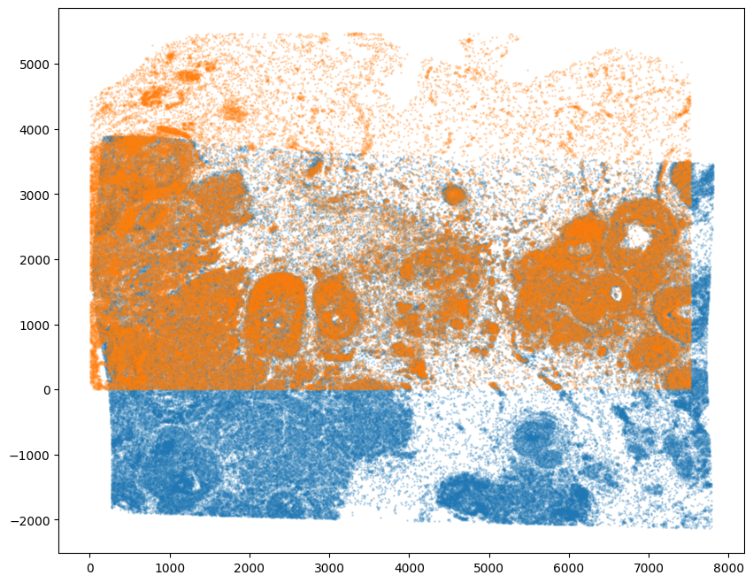
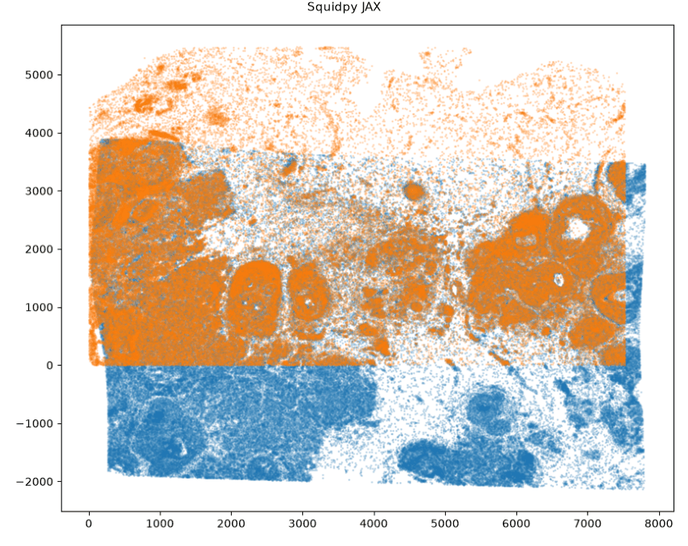
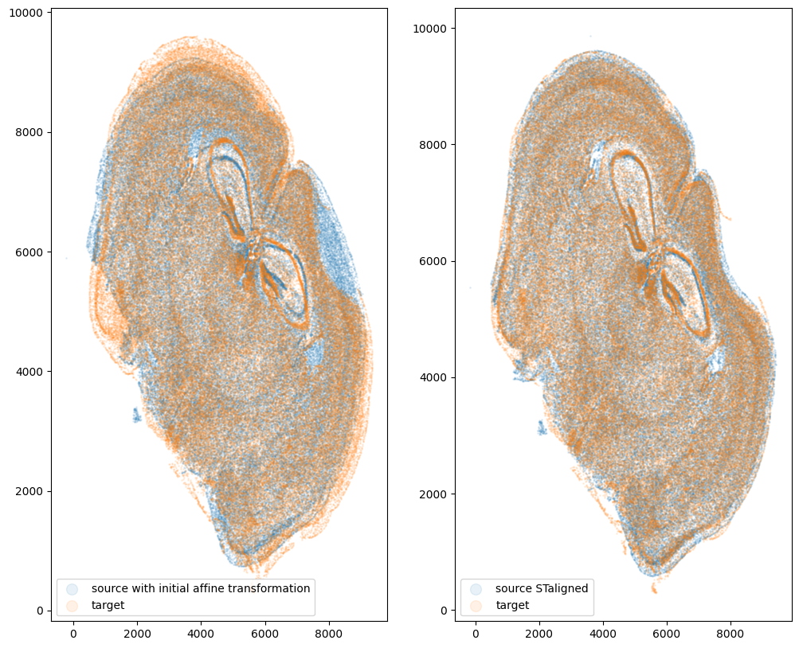
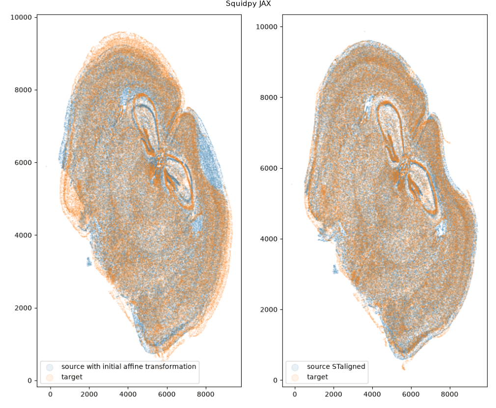
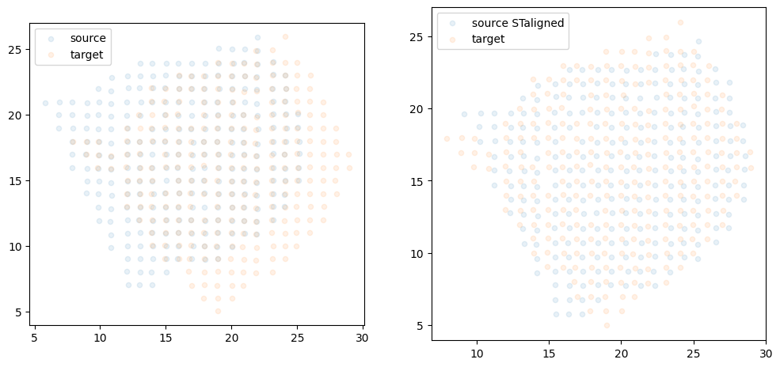

# STalign in squidpy: upstream PyTorch vs the JAX port

squidpy's `experimental.tl.align` reimplements [STalign](https://github.com/JEFworks-Lab/STalign)'s
affine + LDDMM alignment in JAX. This page validates that port against upstream STalign on three
real datasets — it shows what upstream produces natively, the one-to-one comparison against the
port on identical inputs, the numerical agreement, how correctness is enforced by tests, and how to
reproduce every panel from a single container.

All squidpy results here come from the pinned fork
[`selmanozleyen/squidpy@6a63ff8`](https://github.com/selmanozleyen/squidpy/tree/feat/experimental-fit-core);
upstream is pinned to STalign `b2068ed`.

## Running the port

Aligning one sample onto another is a single call — no PyTorch, no manual raster/LDDMM plumbing:

```python
import squidpy as sq

result = sq.experimental.tl.align(
    reference,                 # AnnData / SpatialData holding the fixed sample
    query,                     # the moving sample
    in_="obsm/spatial",
    by="obs",
    method="stalign",
    dx=30.0, blur=1.0,         # rasterisation
    niter=..., epV=...,        # LDDMM schedule (omit for affine-only)
)

aligned = result.aligned_points          # moving points mapped onto the reference frame
warped  = result.warp_image(density)     # push a density/image through the same transform
```

## Upstream result vs the port, side by side

Each pair is **two separate figures**. On the **left** is upstream STalign's own published figure,
**downloaded** from the pinned upstream repo (`_static/reference/`, extracted verbatim from the
vendored notebooks). On the **right** is **our** figure — the *same* plot, produced by the squidpy
JAX port in our run (the port half of the parity replay). The table is the numerical agreement.

### Xenium ↔ Xenium (LDDMM, landmark-guided)

<table width="100%">
<thead><tr><th width="50%">Upstream STalign — downloaded (published)</th><th width="50%">squidpy JAX port — our run</th></tr></thead>
<tbody><tr>
<td></td>
<td></td>
</tr></tbody>
</table>

| metric | value |
|---|---|
| aligned points, relative L2 | 1.6 × 10⁻³ |
| aligned points, median / p95 \|Δ\| | 1.9 µm / 21.6 µm |
| landmark TRE, upstream / port | 28.6 µm / **27.6 µm** |
| warped density, relative L2 | 4.3 × 10⁻² |

Full comparison (densities, pointwise Δ): [`stalign-xenium-comparison`](notebooks/stalign-xenium-comparison).

### MERFISH ↔ MERFISH (LDDMM)

<table width="100%">
<thead><tr><th width="50%">Upstream STalign — downloaded (published)</th><th width="50%">squidpy JAX port — our run</th></tr></thead>
<tbody><tr>
<td></td>
<td></td>
</tr></tbody>
</table>

| metric | value |
|---|---|
| aligned points, relative L2 | 1.0 × 10⁻³ |
| aligned points, median / p95 \|Δ\| | 4.9 µm / 12.5 µm |
| fixed-NN median, upstream / port | 10.92 / 10.92 |
| warped density, relative L2 | 3.5 × 10⁻² |

Full comparison (densities, pointwise Δ): [`stalign-merfish-comparison`](notebooks/stalign-merfish-comparison).

### Visium ↔ Visium (affine-only)

Upstream STalign — downloaded (published):



| metric | value |
|---|---|
| aligned points, relative L2 | 7.8 × 10⁻⁴ |
| aligned points, median / p95 \|Δ\| | 0.020 / 0.020 |
| fixed-NN median, upstream / port | 0.483 / 0.468 |
| warped density, relative L2 | 1.6 × 10⁻² |

No paired port figure here: upstream's Visium overlay cell errors under the GPU build (a documented
upstream/env quirk), so the parity replay skips it. The affine transform still matches upstream to
~1e-6, and the port's own densities + aligned points are in the full run:
[`stalign-visium-affine-comparison`](notebooks/stalign-visium-affine-comparison).

The residual differences above are the deliberately documented rasterisation and boundary-condition
effects at tissue edges — not disagreement in the fitted transform, whose internals agree with
upstream to ~1e-6 and below (see below).

## How the port is kept correct

These panels are corroboration, not the gate. The gate is a seeded reference suite that asserts the
port against upstream at the primitive, energy, gradient, trajectory, converged and image levels —
the velocity field matches to ~1e-15, and the ~1e-3 figures above come from rasterisation at the
boundaries, not from the fit. Every test file is linked from
[How correctness is enforced](correctness.md).

## Reproducing every panel

Everything on this page is reproducible from one container — no cluster, no environment tricks. It
pins the fork, upstream STalign, and the datasets, and stamps the exact fork commit into each run's
manifest. See [`container/README.md`](https://github.com/theislab/squidpy-ports/blob/main/container/README.md):

```bash
apptainer build container/stalign.sif container/stalign.def
apptainer run --nv --writable-tmpfs --bind ./out:/output \
    container/stalign.sif stalign-xenium-comparison.ipynb
```

Each run writes the executed notebook, its panel, and a `*-manifest.json` recording package versions
and `squidpy_commit` — so a result is never separated from the code that produced it.

```{toctree}
:hidden: true
:maxdepth: 1

Xenium ↔ Xenium <notebooks/stalign-xenium-comparison>
MERFISH ↔ MERFISH <notebooks/stalign-merfish-comparison>
Visium ↔ Visium (affine) <notebooks/stalign-visium-affine-comparison>
```
