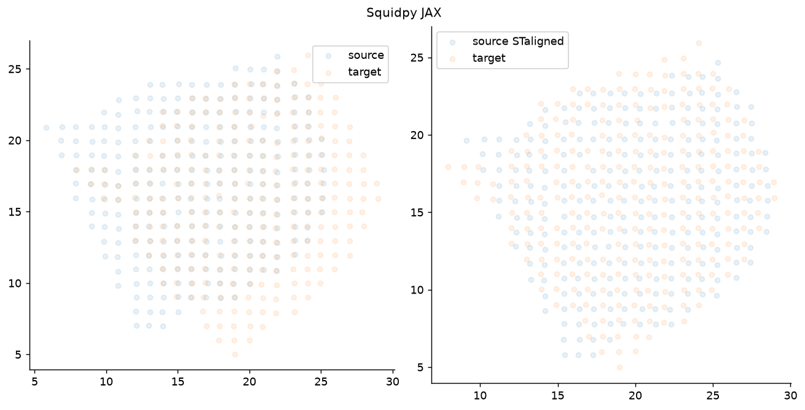

# Visual comparison: upstream PyTorch vs the JAX port

Three real datasets, each showing what upstream STalign produces natively beside what the JAX port
produces on identical inputs, with the numerical agreement between them.

All squidpy results here come from the pinned fork
[`selmanozleyen/squidpy@6a63ff8`](https://github.com/selmanozleyen/squidpy/tree/feat/experimental-fit-core);
upstream is pinned to STalign `b2068ed`.

## Running the port

Aligning one sample onto another is a single call — no PyTorch, no manual raster/LDDMM plumbing:

```python
import squidpy as sq

result = sq.experimental.tl.align(
    reference,                 # AnnData / SpatialData holding the fixed sample
    query,                     # the moving sample
    in_="obsm/spatial",
    by="obs",
    method="stalign",
    dx=30.0, blur=1.0,         # rasterisation
    niter=..., epV=...,        # LDDMM schedule (omit for affine-only)
)

aligned = result.aligned_points          # moving points mapped onto the reference frame
warped  = result.warp_image(density)     # push a density/image through the same transform
```

## Upstream result vs the port, side by side

Each pair is **two separate figures**. On the **left** is upstream STalign's own published figure,
**downloaded** from the pinned upstream repo (`_static/reference/`, extracted verbatim from the
vendored notebooks). On the **right** is **our** figure — the *same* plot, produced by the squidpy
JAX port in our run (the port half of the parity replay). The table is the numerical agreement.

### Xenium ↔ Xenium (LDDMM, landmark-guided)

<table width="100%">
<thead><tr><th width="50%">Upstream STalign — downloaded (published)</th><th width="50%">squidpy JAX port — our run</th></tr></thead>
<tbody><tr>
<td></td>
<td></td>
</tr></tbody>
</table>

| metric | value |
|---|---|
| aligned points, relative L2 | 1.6 × 10⁻³ |
| aligned points, median / p95 \|Δ\| | 1.9 µm / 21.6 µm |
| landmark TRE, upstream / port | 28.6 µm / **27.6 µm** |
| warped density, relative L2 | 4.3 × 10⁻² |

Full comparison (densities, pointwise Δ): [`stalign-xenium-comparison`](notebooks/stalign-xenium-comparison).

### MERFISH ↔ MERFISH (LDDMM)

<table width="100%">
<thead><tr><th width="50%">Upstream STalign — downloaded (published)</th><th width="50%">squidpy JAX port — our run</th></tr></thead>
<tbody><tr>
<td></td>
<td></td>
</tr></tbody>
</table>

| metric | value |
|---|---|
| aligned points, relative L2 | 1.0 × 10⁻³ |
| aligned points, median / p95 \|Δ\| | 4.9 µm / 12.5 µm |
| fixed-NN median, upstream / port | 10.92 / 10.92 |
| warped density, relative L2 | 3.5 × 10⁻² |

Full comparison (densities, pointwise Δ): [`stalign-merfish-comparison`](notebooks/stalign-merfish-comparison).

### Visium ↔ Visium (affine-only)

<table width="100%">
<thead><tr><th width="50%">Upstream STalign — downloaded (published)</th><th width="50%">squidpy JAX port — our run</th></tr></thead>
<tbody><tr>
<td></td>
<td></td>
</tr></tbody>
</table>

| metric | value |
|---|---|
| aligned points, relative L2 | 7.8 × 10⁻⁴ |
| aligned points, median / p95 \|Δ\| | 0.020 / 0.020 |
| fixed-NN median, upstream / port | 0.483 / 0.468 |
| warped density, relative L2 | 1.6 × 10⁻² |

Full comparison (densities, pointwise Δ): [`stalign-visium-affine-comparison`](notebooks/stalign-visium-affine-comparison).

Upstream's Visium overlay cell errors under the GPU build, so unlike the two above, this port
figure is not lifted from the parity replay — the curated notebook redraws upstream's published
figure itself (unaligned left, aligned right) with squidpy's fit substituted for upstream's. Same
plot, same alphas, same labels; only the transform differs.

The residual differences above are the deliberately documented rasterisation and boundary-condition
effects at tissue edges — not disagreement in the fitted transform, whose internals agree with
upstream to ~1e-6 and below (see below).

## These panels are not the gate

These panels are corroboration, not the gate. The gate is a seeded reference suite that asserts the
port against upstream at the primitive, energy, gradient, trajectory, converged and image levels —
the velocity field matches to ~1e-15, and the ~1e-3 figures above come from rasterisation at the
boundaries, not from the fit. Every test, what it asserts, and whether it passes is on
[Numerical tests](correctness.md).

```{toctree}
:hidden: true
:maxdepth: 1

Xenium ↔ Xenium <notebooks/stalign-xenium-comparison>
MERFISH ↔ MERFISH <notebooks/stalign-merfish-comparison>
Visium ↔ Visium (affine) <notebooks/stalign-visium-affine-comparison>
```
